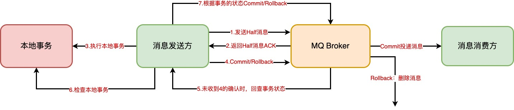

# 分布式事务解决方案： Seata-XA

## 1.基本概念

1. TC(Transaction Coordinator)事务协调者，维护全局和分支事务的状态，驱动全局事务提交或回滚
2. TM(Transaction Manager)事务管理器，定义全局事务的范围：开始全局事务、提交或回滚全局事务。
3. RM(Resource Manager)资源管理器，管理分支事物处理的资源，与TC交谈以注册分支事务和报告分支事务的状态，并驱动分支事务提交或回滚

## 2.前提

1. 基于支持本地ACID事务的关系型数据库。
2. Java应用，通过JDBC访问数据

## 3.机制

- 一阶段：业务数据和回滚日志记录在同一个本地事务中提交，释放本地锁和链接资源
- 二阶段：
  - 提交异步化，非常快速地完成
  - 回滚通过一阶段的回滚日志进行反向补偿

## 4.写隔离

- 一阶段本地事务提交前，需要确保先拿到 **全局锁** 。
- 拿不到 **全局锁** ，不能提交本地事务。
- 拿 **全局锁** 的尝试被限制在一定范围内，超出范围将放弃，并回滚本地事务，释放本地锁。

## 5.读隔离

- 在数据库本地事务隔离级别 **读已提交（Read Committed）** 或以上的基础上，Seata（AT 模式）的默认全局隔离级别是 **读未提交（Read Uncommitted）** 。

## 6.Seata属性

### 6.1.重要属性

| Server端                       |                Client端                |
| :----------------------------- | :------------------------------------: |
| registry.type                  |             registry.type              |
| config.type                    |              config.type               |
| #store.mode=db需要以下配置     | service.vgroupMapping.my_test_tx_group |
| store.db.driverClassName       |       service.default.grouplist        |
| store.db.url                   |    service.disableGlobalTransaction    |
| store.db.user                  |                                        |
| store.db.password              |                                        |
| #store.mode=redis 需要以下配置 |                                        |
| store.redis.host               |                                        |
| store.redis.port               |                                        |
| store.redis.database           |                                        |
| store.redis.password           |                                        |

### 6.2.全部属性

#### 6.2.1.公共部分

| key                     | desc                           | remark                                                       |
| ----------------------- | ------------------------------ | ------------------------------------------------------------ |
| transport.serialization | client和server通信编解码方式   | seata(ByteBuf)、protobuf、kryo、hession、fst，默认seata      |
| transport.compressor    | client和server通信数据压缩方式 | none、gzip，默认none                                         |
| transport.heartbeat     | client和server通信心跳检测开关 | 默认true开启                                                 |
| registry.type           | 注册中心类型                   | 默认file，支持file 、nacos 、eureka、redis、zk、consul、etcd3、sofa、custom |
| config.type             | 配置中心类型                   | 默认file，支持file、nacos 、apollo、zk、consul、etcd3、custom |

#### 6.2.2.Server端

| key                                       | desc                                             | remark                                                       |
| ----------------------------------------- | ------------------------------------------------ | ------------------------------------------------------------ |
| server.undo.logSaveDays                   | undo保留天数                                     | 默认7天,log_status=1（附录3）和未正常清理的undo              |
| server.undo.logDeletePeriod               | undo清理线程间隔时间                             | 默认86400000，单位毫秒                                       |
| server.maxCommitRetryTimeout              | 二阶段提交重试超时时长                           | 单位ms,s,m,h,d,对应毫秒,秒,分,小时,天,默认毫秒。默认值-1表示无限重试。公式: timeout>=now-globalTransactionBeginTime,true表示超时则不再重试(注: 达到超时时间后将不会做任何重试,有数据不一致风险,除非业务自行可校准数据,否者慎用) |
| server.maxRollbackRetryTimeout            | 二阶段回滚重试超时时长                           | 同commit                                                     |
| server.recovery.committingRetryPeriod     | 二阶段提交未完成状态全局事务重试提交线程间隔时间 | 默认1000，单位毫秒                                           |
| server.recovery.asynCommittingRetryPeriod | 二阶段异步提交状态重试提交线程间隔时间           | 默认1000，单位毫秒                                           |
| server.recovery.rollbackingRetryPeriod    | 二阶段回滚状态重试回滚线程间隔时间               | 默认1000，单位毫秒                                           |
| server.recovery.timeoutRetryPeriod        | 超时状态检测重试线程间隔时间                     | 默认1000，单位毫秒，检测出超时将全局事务置入回滚会话管理器   |
| store.mode                                | 事务会话信息存储方式                             | file本地文件(不支持HA)，db数据库\|redis(支持HA)              |
| store.file.dir                            | file模式文件存储文件夹名                         | 默认sessionStore                                             |
| store.db.datasource                       | db模式数据源类型                                 | dbcp、druid、hikari；无默认值，store.mode=db时必须指定。     |
| store.db.dbType                           | db模式数据库类型                                 | mysql、oracle、db2、sqlserver、sybaee、h2、sqlite、access、postgresql、oceanbase；无默认值，store.mode=db时必须指定。 |
| store.db.driverClassName                  | db模式数据库驱动                                 | store.mode=db时必须指定                                      |
| store.db.url                              | db模式数据库url                                  | store.mode=db时必须指定，在使用mysql作为数据源时，建议在连接参数中加上`rewriteBatchedStatements=true`(详细原因请阅读附录7) |
| store.db.user                             | db模式数据库账户                                 | store.mode=db时必须指定                                      |
| store.db.password                         | db模式数据库账户密码                             | store.mode=db时必须指定                                      |
| store.db.minConn                          | db模式数据库初始连接数                           | 默认1                                                        |
| store.db.maxConn                          | db模式数据库最大连接数                           | 默认20                                                       |
| store.db.maxWait                          | db模式获取连接时最大等待时间                     | 默认5000，单位毫秒                                           |
| store.db.globalTable                      | db模式全局事务表名                               | 默认global_table                                             |
| store.db.branchTable                      | db模式分支事务表名                               | 默认branch_table                                             |
| store.db.lockTable                        | db模式全局锁表名                                 | 默认lock_table                                               |
| store.db.queryLimit                       | db模式查询全局事务一次的最大条数                 | 默认100                                                      |
| store.redis.host                          | redis模式ip                                      | 默认127.0.0.1                                                |
| store.redis.port                          | redis模式端口                                    | 默认6379                                                     |
| store.redis.maxConn                       | redis模式最大连接数                              | 默认10                                                       |
| store.redis.minConn                       | redis模式最小连接数                              | 默认1                                                        |
| store.redis.database                      | redis模式默认库                                  | 默认0                                                        |
| store.redis.password                      | redis模式密码(无可不填)                          | 默认null                                                     |
| store.redis.queryLimit                    | redis模式一次查询最大条数                        | 默认100                                                      |
| metrics.enabled                           | 是否启用Metrics                                  | 默认false关闭，在False状态下，所有与Metrics相关的组件将不会被初始化，使得性能损耗最低 |
| metrics.registryType                      | 指标注册器类型                                   | Metrics使用的指标注册器类型，默认为内置的compact（简易）实现，这个实现中的Meter仅使用有限内存计数，性能高足够满足大多数场景；目前只能设置一个指标注册器实现 |
| metrics.exporterList                      | 指标结果Measurement数据输出器列表                | 默认prometheus，多个输出器使用英文逗号分割，例如"prometheus,jmx"，目前仅实现了对接prometheus的输出器 |
| metrics.exporterPrometheusPort            | prometheus输出器Client端口号                     | 默认9898                                                     |

#### 6.2.3.Client端

| key                                                | desc                                        | remark                                                       |
| -------------------------------------------------- | ------------------------------------------- | ------------------------------------------------------------ |
| seata.enabled                                      | 是否开启spring-boot自动装配                 | true、false,(SSBS)专有配置，默认true（附录4）                |
| seata.enableAutoDataSourceProxy=true               | 是否开启数据源自动代理                      | true、false,seata-spring-boot-starter(SSBS)专有配置,SSBS默认会开启数据源自动代理,可通过该配置项关闭. |
| seata.useJdkProxy=false                            | 是否使用JDK代理作为数据源自动代理的实现方式 | true、false,(SSBS)专有配置,默认false,采用CGLIB作为数据源自动代理的实现方式 |
| transport.enableClientBatchSendRequest             | 客户端事务消息请求是否批量合并发送          | 默认true，false单条发送                                      |
| client.log.exceptionRate                           | 日志异常输出概率                            | 默认100，目前用于undo回滚失败时异常堆栈输出，百分之一的概率输出，回滚失败基本是脏数据，无需输出堆栈占用硬盘空间 |
| service.vgroupMapping.my_test_tx_group             | 事务群组（附录1）                           | my_test_tx_group为分组，配置项值为TC集群名                   |
| service.default.grouplist                          | TC服务列表（附录2）                         | 仅注册中心为file时使用                                       |
| service.disableGlobalTransaction                   | 全局事务开关                                | 默认false。false为开启，true为关闭                           |
| client.tm.degradeCheck                             | 降级开关                                    | 默认false。业务侧根据连续错误数自动降级不走seata事务(详细介绍请阅读附录6) |
| client.tm.degradeCheckAllowTimes                   | 升降级达标阈值                              | 默认10                                                       |
| client.tm.degradeCheckPeriod                       | 服务自检周期                                | 默认2000,单位ms.每2秒进行一次服务自检,来决定                 |
| client.rm.reportSuccessEnable                      | 是否上报一阶段成功                          | true、false，从1.1.0版本开始,默认false.true用于保持分支事务生命周期记录完整，false可提高不少性能 |
| client.rm.asyncCommitBufferLimit                   | 异步提交缓存队列长度                        | 默认10000。 二阶段提交成功，RM异步清理undo队列               |
| client.rm.lock.retryInterval                       | 校验或占用全局锁重试间隔                    | 默认10，单位毫秒                                             |
| client.rm.lock.retryTimes                          | 校验或占用全局锁重试次数                    | 默认30                                                       |
| client.rm.lock.retryPolicyBranchRollbackOnConflict | 分支事务与其它全局回滚事务冲突时锁策略      | 默认true，优先释放本地锁让回滚成功                           |
| client.rm.reportRetryCount                         | 一阶段结果上报TC重试次数                    | 默认5次                                                      |
| client.rm.tableMetaCheckEnable                     | 自动刷新缓存中的表结构                      | 默认false                                                    |
| client.tm.commitRetryCount                         | 一阶段全局提交结果上报TC重试次数            | 默认1次，建议大于1                                           |
| client.tm.rollbackRetryCount                       | 一阶段全局回滚结果上报TC重试次数            | 默认1次，建议大于1                                           |
| client.undo.dataValidation                         | 二阶段回滚镜像校验                          | 默认true开启，false关闭                                      |
| client.undo.logSerialization                       | undo序列化方式                              | 默认jackson                                                  |
| client.undo.logTable                               | 自定义undo表名                              | 默认undo_log                                                 |
| client.undo.onlyCareUpdateColumns                  | 只生成被更新列的镜像                        | 默认true                                                     |
| client.rm.sqlParserType                            | sql解析类型                                 | 默认druid,可选antlr                                          |

[详细信息查看官网]: http://seata.io/zh-cn/docs/user/configurations.html

## 7.事务分组

> - 事务分组：seata的资源逻辑，可以按照微服务的需要，在client端自行定义事务分组，每组取一个名字
> - 集群：seata-server服务端一个或多个节点组成的集群cluster。client端需要指定事务逻辑分组与Seata服务端集群的映射关系

# 分布式事务解决方案： Seata-TCC

**相关框架**

| 框架名称          | 幂等性     | 嵌套调用         | RPC框架支持                       | 默认支持事务                 | 可靠性 | GitHub地址                                        |
| ----------------- | ---------- | ---------------- | --------------------------------- | ---------------------------- | ------ | ------------------------------------------------- |
| tcc-transaction   | 框架不支持 | 嵌套调用尝试失败 | 不耦合RPC框架                     | DB、redis、zk、file          | 通过   | *https://github.com/changmingxie/tcc-transaction* |
| Hmily             | 框架不支持 | 嵌套调用尝试失败 | Dubbo、motan、springcloud         | redis、mongodb、zk，file，DB | 通过   | *https://github.com/yu199195/hmily*               |
| ByteTCC           | 框架支持   | 嵌套调用尝试失败 | Dubbo、springcloud                | file                         | 通过   | *https://github.com/liuyangming/ByteTCC*          |
| *EasyTransaction* | 框架支持   | 支持嵌套调用     | Dubbo、SpringCloud、Ribbon/Eureka | DB、Redis                    | 通过   | *https://github.com/QNJR-GROUP/EasyTransaction*   |
| Seata-TCC         | 未测试     | 未测试           | SpringCloud、NacOS、Seata         | redis、mongodb、zk、file、DB | 通过   | https://github.com/seata/seata                    |

 

## 1. 基本概念

> TCC:
>
> **Try:** Try 阶段是做业务检查(一致性)及资源预留(隔离)，此阶段仅是一个初步操作，它和后续的Confirm一起才能真正构成一个完整的业务逻辑。
>
> **Confirm:** Confirm 阶段是做确认提交，Try阶段所有分支事务执行成功后开始执行 Confirm。通常情况下，采用
>  ICC则认为 Confirm阶段是不会出错的。即：只要Try成功，Confirm一定成功。若Confirm阶段真的出错了，需引入重试机制或人工处理。
>
> **Cancel:** Cancel 阶段是在业务执行错误需要回滚的状态下执行分支事务的业务取消，预留资源释放。通常情况下，采用ICC则认为Cancel阶段也是一定成功的。若Cancel阶段真的出错了，需引1入重试机制或人工处理。
>
> **TM事务管理器：** TM事务管理器可以实现为独立的服务，也可以让全局事务发起方充当TM的角色，TM独立出来是为了成为公用组件，是为了考虑系统结构和软件复用。TM在发起全局事务时生成全局事务记录，全局事务1爱穿整个分布式事务调用链条 ，用来记录事务上下文，追踪和记录状态，由于Confirm 和cancel失败需进行重试，因此需要实现为嘉等，幂等性是指同一个操作无论请求多少次，其结果都相同。

## 2.异常控制

### 2.1.空回滚

**出现原因：**

- Try超时（丢包）
- 分布式事务回滚，触发Cancel
- 未收到Try，收到Cancel

> Try还未执行，Cancel先执行了，就导致空回滚

**解决办法：**

> 数据库额外的**事物控制表**，记录一阶段事物ID和分支事物ID，Cancel时读取此记录，如果存在则回滚，如果不存在则是空回滚，进行业务处理

### 2.2.消费幂等性

**出现原因：**

- 网络异常
- TC Server异常

> 重复调用二阶段Confirm，导致重复消费

**解决办法：**

> 事物控制表记录每个分支事物的执行状态，如果已执行则返回成功，不在进行重复执行。

### 2.3.防悬挂

出现原因

- Try超时（拥堵）
- 分布式事务回滚，出发Cancel
- 拥堵的Try到达

解决办法：

> 在事物控制表中记录是否执行了二阶段的Cancel，如果执行了，则一阶段不执行。

## 3.TCC各个阶段判断

### 3.1.try阶段

### 3.2.confirm阶段

### 3.3.cancel

## 4.TCC性能优化

- 同库模式改造
  - 事务日志与业务数据在相同库存储
  - 优化减少N+2次RPC，性能提升50%
- 二阶段一步执行
  - 一阶段同步执行，二阶段一步执行，事务好事减少50%左右

# 分布式事务解决方案：可靠消息最终一致性

> 当事务发起方执行完成本地事务后发出一条消息，事务参与方（消息消费者）一定能够接受消息并处理事务成功，强调最终一致性。

## 1.本地事务与消息发送的原子性问题

> 本地事务与消息发送的原子性问题即：事务发起方在本地事务执行成功后消息必须发送出去，否则就丢弃消息。即实现本地事务和消息发送的原子性。本地事务与消息发送的原子性问题是实现可靠消息最终一致性方案的关键问题

## 2.事务参与方接收消息的可靠性

> 事务参与方必须能够从消息队列接收到消息，如果接收消息失败可以重复接收消息

## 3.消息重复消费的问题

> 由于网络波动的存在，若一个消费节点超时但是消费成功，此时消息中间件会重复投递辞消息，就导致了消息的重复消费
>
> 解决办法: 事务参与方的方法幂等性判断

## 4.基本流程

